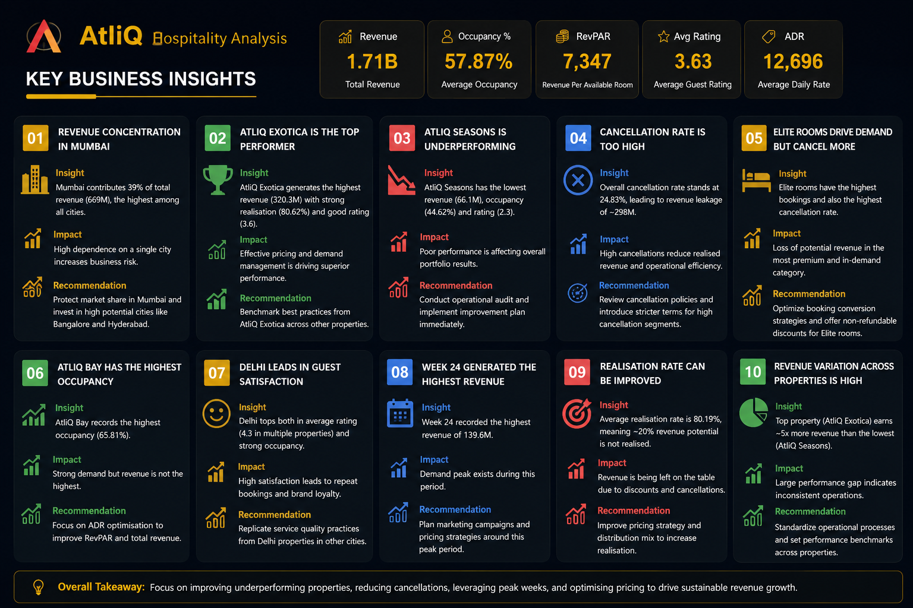

# AtliQ Hospitality Analysis Dashboard | Power BI

## Project Overview

AtliQ Grands is a luxury hotel chain operating across multiple cities in India. Due to increasing competition and declining market performance, the management wanted to leverage Business Intelligence and Data Analytics to improve revenue management and operational decision-making.

This project focuses on building an interactive Power BI dashboard that helps stakeholders monitor key hospitality KPIs, analyze business performance, identify revenue opportunities, and uncover operational challenges across properties and cities.

---

## Problem Statement

AtliQ Grands lacked a centralized analytics solution to track business performance across its hotel properties. Stakeholders required an interactive dashboard that could provide visibility into revenue trends, occupancy patterns, customer ratings, and booking cancellations.

The objective was to transform raw hospitality data into meaningful insights that support data-driven decision-making.

---

## Stakeholder Requirements

The dashboard was developed based on a stakeholder-provided mockup and business requirements.

Key requirements included:

- Revenue Analysis
- Occupancy Tracking
- Property Performance Monitoring
- City-Level Analysis
- Booking Platform Analysis
- Week-over-Week Trend Analysis
- Interactive Filtering
- KPI Tracking

---

## Tools & Technologies Used

- Power BI
- Power Query
- DAX
- Excel

---

## Dataset

The project utilizes hospitality booking and hotel performance datasets provided as part of the Codebasics Hospitality Analytics Challenge.

### Dataset Files

- dim_date.csv
- dim_hotels.csv
- dim_rooms.csv
- fact_bookings.csv
- fact_aggregated_bookings.csv

All source files are available in the `datasets` folder.

---

## Data Modeling

Designed a star-schema data model using fact and dimension tables to ensure efficient performance, scalability, and accurate KPI calculations.

### Key Modeling Concepts Applied

- Fact and Dimension Tables
- Data Relationships
- Data Transformation
- Business Logic Implementation
- KPI Calculation Framework

---

## Dashboard Features

### Executive Overview

Tracks key hospitality metrics:

- Revenue
- Occupancy %
- ADR (Average Daily Rate)
- RevPAR (Revenue Per Available Room)
- Realisation %
- Cancellation Rate
- Average Customer Rating

### Performance Analysis

Provides detailed performance monitoring through:

- Week-over-Week KPI Comparison
- Revenue Trend Analysis
- Occupancy Trend Analysis
- Property-Level Performance Tracking
- City-Level Analysis

### Interactive Features

Implemented interactive user experience features including:

- Dynamic KPI Cards
- Interactive Slicers
- Property-Level Filtering
- City-Level Filtering
- Month and Week Analysis
- Dashboard Navigation
- Bookmarks
- Dynamic Visual Interactions

### Custom Calendar Heatmap

Developed a custom calendar heatmap using matrix visuals and conditional formatting to provide a clear view of occupancy trends over time.

This visualization helps stakeholders quickly identify high-performing and low-performing periods.

---

## Key DAX Measures Created

Examples of measures developed during the project:

- Revenue
- Occupancy %
- ADR
- RevPAR
- Realisation %
- Cancellation Rate
- Average Rating
- Week-over-Week KPI Analysis
- Dynamic KPI Variance Metrics

---

## Dashboard Preview

### Stakeholder Mockup

### Executive Dashboard

### Performance Analysis

### Insights Page

### Calendar Heatmap

### Data Model

---

## Key Business Insights

- Mumbai emerged as the highest revenue-generating city.
- Revenue contribution varied significantly across cities and properties.
- Booking cancellations had a substantial impact on realized revenue.
- Occupancy trends differed across weekdays and weekends.
- Certain room categories contributed more bookings while also experiencing higher cancellation rates.
- Property performance varied across locations, highlighting opportunities for operational improvements.

---

## What I Learned

Through this project, I gained hands-on experience in:

- Data Cleaning and Transformation using Power Query
- Data Modeling using Fact and Dimension Tables
- Creating Advanced DAX Measures
- Hospitality KPI Analysis
- Dashboard Storytelling
- Stakeholder Requirement Analysis
- Business Performance Reporting
- Interactive Dashboard Development
- Bookmarks and Navigation Design
- Custom Calendar Heatmap Development

One of the biggest learnings from this project was understanding how business requirements, analytics, and dashboard design come together to support decision-making.

---

## Skills Demonstrated

- Power BI
- DAX
- Power Query
- Data Modeling
- Data Analysis
- Data Visualization
- Dashboard Development
- KPI Reporting
- Business Analytics
- Revenue Analysis
- Hospitality Analytics
- Business Intelligence

---

## Author

### Faisal Arif

Aspiring Data Analyst passionate about transforming raw data into actionable business insights through Power BI, SQL, Excel, and Business Intelligence solutions.

### Connect With Me

- LinkedIn: [https://www.linkedin.com/in/faisal-sayyed1/]
