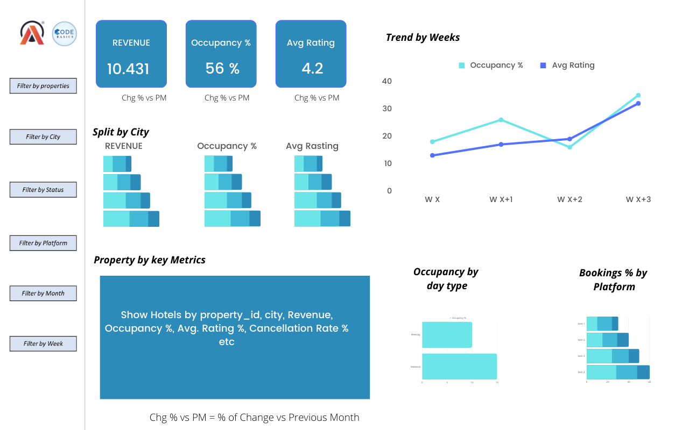
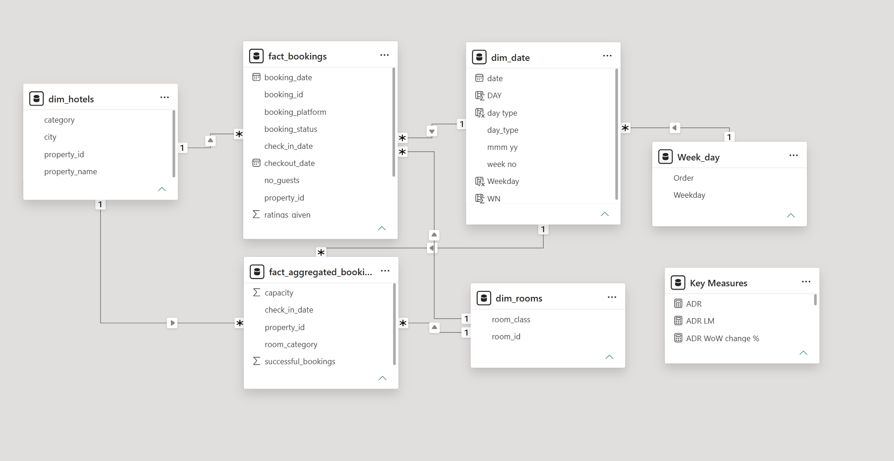
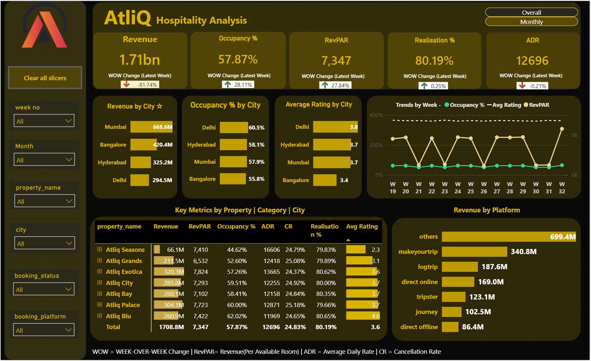
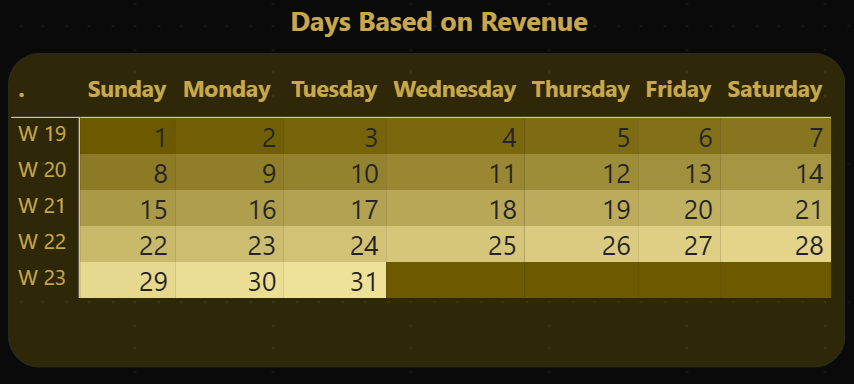

# AtliQ Hospitality Analysis Dashboard | Power BI

As part of the Codebasics Hospitality Analytics Challenge, I developed an end-to-end Power BI solution to analyze hotel performance, revenue trends, occupancy patterns, and booking behavior. The project focused on transforming raw hospitality data into actionable business insights through interactive dashboards and KPI reporting.

---

## Challenge Link

🔗 https://codebasics.io/challenge/codebasics-resume-project-challenge

---

## Problem Statement

AtliQ Grands is a luxury hotel chain operating across multiple cities in India. Due to increasing competition and ineffective decision-making, the company has been losing market share in the luxury and business hotel segment.

To support data-driven decision-making, the management wanted to leverage Business Intelligence and Analytics to better understand revenue performance, occupancy trends, customer behavior, and booking cancellations.

As a Data Analyst, the objective was to build an interactive dashboard that transforms raw hospitality data into meaningful business insights.

---

## Task List

As a Data Analyst, I was provided with hospitality datasets and a stakeholder-defined dashboard mockup to complete the following tasks:

- Create and validate business metrics based on the provided metric requirements.
- Develop an interactive Power BI dashboard aligned with stakeholder expectations.
- Analyze hospitality performance across properties, cities, and booking platforms.
- Generate actionable business insights beyond the provided requirements.
- Present key findings through effective data visualization and dashboard storytelling.

---

## Tools & Technologies Used

- Power BI
- DAX
- Power Query
- Excel

---

## Skills Demonstrated

- Data Cleaning
- Data Transformation
- Data Modeling
- KPI Reporting
- Dashboard Development
- Data Visualization
- Business Analytics
- Hospitality Analytics
- Dashboard Storytelling
- Business Intelligence

---

## Dataset

The project utilizes hospitality booking and hotel performance datasets provided as part of the Codebasics Hospitality Analytics Challenge.

### Dataset Files

- dim_date.csv
- dim_hotels.csv
- dim_rooms.csv
- fact_bookings.csv
- fact_aggregated_bookings.csv

---

## Stakeholder Mockup

The dashboard was developed based on a stakeholder-provided mockup.

---

## Data Model

---

## Dashboard Views

### Executive Overview

### Performance Analysis

### Insights Dashboard

### Calendar Heatmap

---

## Key Metrics Tracked

- Revenue
- Occupancy %
- ADR (Average Daily Rate)
- RevPAR (Revenue Per Available Room)
- Realisation %
- Cancellation Rate
- Average Rating
- Week-over-Week Performance

---

## Key Business Insights

- Mumbai generated the highest overall revenue among all cities.
- Booking cancellations had a significant impact on realized revenue.
- Revenue contribution varied across cities and hotel properties.
- Occupancy performance differed across weekdays and weekends.
- Certain room categories attracted higher bookings while also experiencing higher cancellation rates.
- Property-level analysis highlighted opportunities for improving occupancy and revenue realization.
- Performance trends helped identify top-performing and underperforming locations.

---

## What I Learned

Through this project, I gained hands-on experience in:

- Creating hospitality KPIs using DAX.
- Building a custom calendar heatmap using matrix visuals and conditional formatting.
- Implementing data modeling using fact and dimension tables.
- Designing interactive dashboards using bookmarks and navigation buttons.
- Applying dashboard storytelling principles to communicate business insights effectively.
- Translating stakeholder requirements into business-focused analytical solutions.
- Performing KPI analysis using Revenue, ADR, RevPAR, Occupancy %, and Cancellation metrics.

One of the biggest learnings from this project was understanding how business requirements, analytics, and dashboard design come together to support decision-making.

---

## Dashboard Features

### Executive Overview
- Revenue Analysis
- Occupancy Analysis
- ADR & RevPAR Tracking
- Realisation %
- Cancellation Analysis
- Customer Rating Monitoring

### Performance Analysis
- Week-over-Week KPI Tracking
- Trend Analysis
- Property Performance Monitoring
- City-Level Analysis

### Interactive Features
- Dynamic KPI Cards
- Interactive Slicers
- Property Filters
- City Filters
- Dashboard Navigation
- Bookmarks
- Dynamic Visual Interactions

### Custom Calendar Heatmap
- Occupancy Trend Analysis
- Daily Performance Monitoring
- Conditional Formatting Visualization

## Author

### Faisal Arif

Aspiring Data Analyst passionate about transforming raw data into actionable business insights through Power BI, SQL, Excel, and Business Intelligence solutions.

### Connect With Me

- LinkedIn: [https://www.linkedin.com/in/faisal-sayyed1/]
