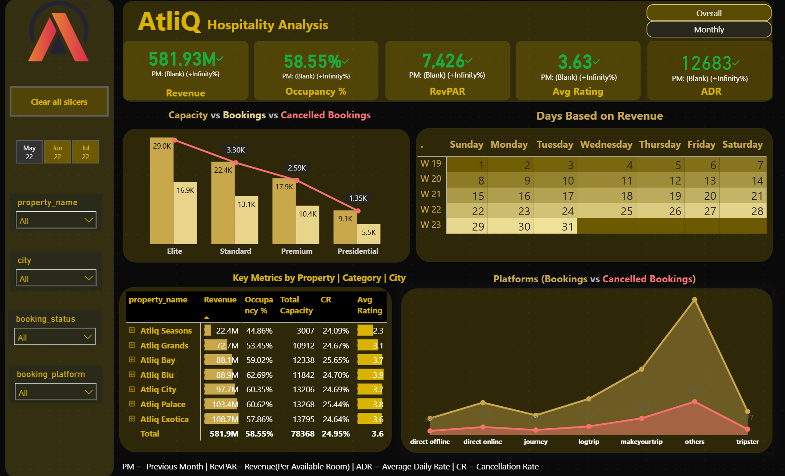

# AtliQ Hospitality Analysis Dashboard | Power BI

## Project Overview

AtliQ Grands is a luxury hotel chain operating across multiple cities in India.

The objective of this project was to build an interactive Power BI dashboard that helps stakeholders monitor key hospitality KPIs, analyze revenue performance, track occupancy trends, and identify business opportunities using data-driven insights.

---
## Stakeholder Requirements

The project was developed based on a stakeholder-provided dashboard mockup.

### Mockup Dashboard

The final dashboard was enhanced with additional analytics, KPI tracking, business insights, and interactive features beyond the original mockup.
## Tools Used

- Power BI
- DAX
- Power Query
- Excel

## Skills Demonstrated

- Data Modeling
- Data Cleaning
- Data Transformation
- KPI Reporting
- Dashboard Development
- Business Analytics
- Data Visualization
## Dashboard Preview

### Executive Overview

### Executive Overview

### Insights Page

### Calendar Heatmap

## Key Learnings

- Built hospitality KPIs using DAX.
- Created a custom calendar heatmap using matrix visuals and conditional formatting.
- Applied data modeling concepts using fact and dimension tables.
- Implemented dashboard navigation using bookmarks and buttons.
- Developed business-focused dashboards based on stakeholder requirements.
